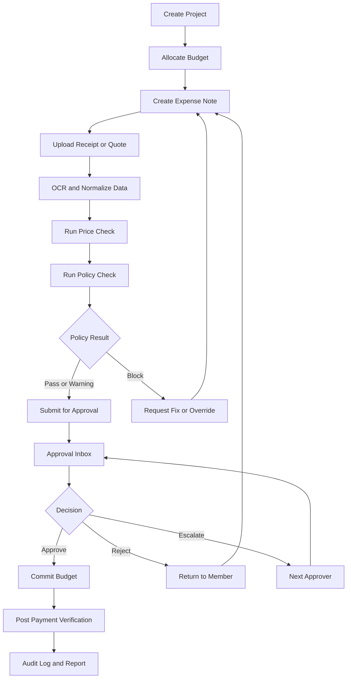
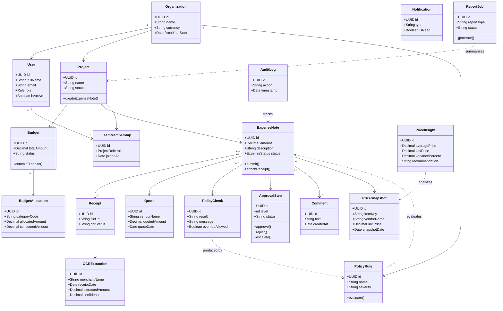

# CacheCash V1.0.0 Project Documentation

## 1. Executive Summary

CacheCash คือแอปจัดการการเงินโครงการแบบทำงานร่วมกันสำหรับทีมจัดซื้อ ชมรม องค์กรขนาดเล็ก และทีมกิจกรรมที่ต้องการควบคุมงบประมาณ การขอเบิก เอกสารใบเสร็จ การอนุมัติ และการออกรายงานให้อยู่ในพื้นที่ทำงานเดียว

แนวคิดหลักของผลิตภัณฑ์คือทำให้ประสบการณ์ใช้งานคล้ายแอปจดบันทึกแบบกลุ่ม แต่ทุกบันทึกเป็นรายการทางการเงินที่ตรวจสอบย้อนกลับได้ มีบริบทของราคา เอกสาร นโยบาย ผู้เกี่ยวข้อง และสถานะงบประมาณครบในหน้าเดียว

โจทย์การแข่งขัน Price Tracking & Policy Intelligence ถูกผสานเข้ากับ flow หลักของระบบ ไม่ได้แยกเป็นโมดูลโดด ๆ โดยระบบจะช่วยเปรียบเทียบราคา ตรวจนโยบาย และแจ้งความเสี่ยงก่อนส่งอนุมัติและระหว่างการอนุมัติ

## 2. Product Vision

### Vision Statement

สร้างแพลตฟอร์มจัดการงบประมาณและค่าใช้จ่ายรายโครงการที่ใช้ง่ายแบบแอปจด แต่มีวินัยทางการเงินระดับองค์กรขนาดเล็กถึงกลาง

### Product Positioning

CacheCash อยู่กึ่งกลางระหว่างแอปบันทึกรายจ่ายทั่วไปกับระบบ ERP ขนาดใหญ่ โดยเน้น 3 จุดต่างสำคัญ

1. ใช้งานง่ายเหมือน collaborative note app
2. มีข้อมูลราคาและกฎนโยบายช่วยตัดสินใจตั้งแต่ต้นทาง
3. รองรับโครงสร้างงบประมาณและการอนุมัติแบบโครงการได้จริง

## 3. Problem Statement

หลายทีมยังจัดการค่าใช้จ่ายผ่านแชต สเปรดชีต และไฟล์กระจัดกระจาย ทำให้เกิดปัญหาต่อไปนี้

1. ไม่เห็นสถานะงบแบบเรียลไทม์
2. การขอเบิกและการอนุมัติใช้เวลานาน
3. ใบเสร็จและหลักฐานหายหรือข้อมูลไม่ครบ
4. ไม่มีฐานข้อมูลราคาเดิมเพื่อช่วยตัดสินใจ
5. การตรวจนโยบายทำหลังบ้านและพลาดได้ง่าย
6. การสรุปรายงานเพื่อส่งต่อฝ่ายบัญชีใช้แรงงานสูง

## 4. Proposed Solution

CacheCash เปลี่ยนทุกค่าใช้จ่ายให้เป็น Expense Note ที่มีองค์ประกอบต่อไปนี้

1. ข้อมูลรายการใช้จ่าย
2. โปรเจกต์และหมวดบัญชีที่เกี่ยวข้อง
3. ใบเสร็จหรือเอกสารแนบ
4. ผล OCR และข้อมูลที่สกัดได้
5. ผลเปรียบเทียบราคา
6. ผลตรวจนโยบาย
7. สถานะการอนุมัติ
8. คอมเมนต์จากคนในทีม
9. ร่องรอยการเปลี่ยนแปลงเพื่อ audit

ผลลัพธ์คือทีมสามารถสร้าง ขออนุมัติ ตรวจสอบ และสรุปรายการทางการเงินได้ใน object เดียว

## 5. Target Users

### Primary Users

1. Finance or Procurement Manager
2. Project Lead
3. Team Member
4. Approver
5. Auditor

### Secondary Users

1. System Admin
2. Accounting Team
3. CLI User สำหรับทดสอบ flow หรือทำ batch operation

## 6. Core Features

1. สร้างองค์กร ทีม และโปรเจกต์
2. กำหนดงบประมาณรวมและแยกงบตามหมวดบัญชี
3. สร้าง Expense Note แบบ collaborative
4. อัปโหลดใบเสร็จและดึงข้อมูลด้วย OCR
5. ส่งคำขอเบิกและอนุมัติหลายระดับ
6. ตรวจสอบหลังการจ่ายเงินจริง
7. ติดตามงบประมาณแบบเรียลไทม์
8. ค้นหาและวิเคราะห์รายการย้อนหลัง
9. ออกรายงานการเงินและรายงาน audit
10. แจ้งเตือนเมื่อวงเงินใกล้เต็มหรือเอกสารไม่ครบ

## 7. Price Tracking & Policy Intelligence

### 7.1 Price Tracking

Price Tracking คือกลไกเปรียบเทียบและติดตามราคาที่เกิดขึ้นจริงในระบบ โดยอาศัยข้อมูลจาก

1. ใบเสร็จย้อนหลัง
2. ใบเสนอราคา
3. ราคาที่กรอกมือจากผู้ใช้
4. ประวัติ vendor เดิมในโครงการหรือองค์กรเดียวกัน

ระบบจะสร้าง Price Snapshot เพื่อใช้วิเคราะห์

1. ราคาล่าสุดของสินค้า or บริการเดิม
2. ราคาเฉลี่ยในหมวดเดียวกัน
3. แนวโน้มราคาย้อนหลังตามเวลา
4. vendor ทางเลือกที่เคยให้ราคาดีกว่า
5. ส่วนต่างราคาจาก baseline ภายในองค์กร

### 7.2 Policy Intelligence

Policy Intelligence คือระบบประเมินความสอดคล้องของรายการค่าใช้จ่ายกับกฎองค์กร โดยให้ผลลัพธ์เป็น

1. `PASS`
2. `WARNING`
3. `BLOCK`

กฎที่รองรับใน V1.0.0

1. วงเงินหมวดใกล้เต็มหรือเกินวงเงิน
2. ยอดเงินเกิน threshold ที่ต้องอนุมัติระดับสูงขึ้น
3. หมวดใช้จ่ายที่ต้องมีเอกสารแนบ
4. ใบเสร็จเก่าเกิน policy
5. รายการซ้ำหรือใกล้เคียงรายการเดิม
6. ต้องมี quote ขั้นต่ำในบางหมวด
7. vendor ที่เคยแพงกว่าค่าเฉลี่ยมากผิดปกติ

### 7.3 Why It Fits The Competition

หัวข้อการแข่งขันจะไม่รู้สึกถูกฝืนใส่ เพราะ Price Tracking และ Policy Intelligence ทำงานอยู่ในขั้นตอนตัดสินใจจริง

1. ก่อน submit ระบบช่วยบอกว่าราคาสูงเกินไปหรือไม่
2. ตอนอนุมัติ approver เห็น risk และ policy result ทันที
3. ตอนทำ dashboard ผู้จัดการเห็น category ที่เริ่มแพงขึ้น
4. ตอนออกรายงาน auditor เห็นรายการที่มี exception ได้ทันที

## 8. Business Rules

1. ทุก Expense Note ต้องผูกกับ Project เสมอ
2. ทุก Expense Note ต้องมี Category ภายใต้ Chart of Accounts
3. รายการที่เกิน threshold ตาม policy ต้องถูกส่งอนุมัติเพิ่มระดับ
4. รายการที่มี policy result แบบ `BLOCK` ห้ามผ่านขั้น submit หรือ approval โดยไม่มี override reason
5. การอนุมัติสำเร็จต้องกระทบ committed budget ทันที
6. Receipt OCR เป็น asynchronous flow และผู้ใช้ยังสามารถแก้ข้อมูลได้
7. ต้องเก็บ audit log สำหรับทุก transition สำคัญ

## 9. Use Cases

| ID | Use Case | Primary Actor | ผลลัพธ์ |
| --- | --- | --- | --- |
| UC-01 | Create organization | System Admin | สร้าง workspace องค์กร |
| UC-02 | Invite member and assign role | System Admin | จัดสิทธิ์ผู้ใช้งาน |
| UC-03 | Create project | Project Lead | สร้างพื้นที่ทำงานโครงการ |
| UC-04 | Define budget and allocations | Finance Manager | ตั้งงบรวมและหมวดบัญชี |
| UC-05 | Create expense note | Team Member | สร้างรายการค่าใช้จ่าย |
| UC-06 | Upload receipt and run OCR | Team Member | ได้ข้อมูลสกัดจากใบเสร็จ |
| UC-07 | Add quote or price reference | Team Member | เพิ่มราคาสำหรับเปรียบเทียบ |
| UC-08 | Run price check | System | สรุป insight ด้านราคา |
| UC-09 | Run policy check | System | สรุปผล pass warning block |
| UC-10 | Submit bill request | Team Member | รายการเข้าสู่ approval flow |
| UC-11 | Review approval inbox | Approver | เห็นรายการรออนุมัติ |
| UC-12 | Approve reject escalate request | Approver | เปลี่ยนสถานะการอนุมัติ |
| UC-13 | Verify post-payment | Finance Manager | ปิดรายการหลังจ่ายจริง |
| UC-14 | Track budget dashboard | Project Lead | เห็นวงเงินคงเหลือและความเสี่ยง |
| UC-15 | Export report | Auditor | ได้รายงานการเงินและ audit |
| UC-16 | Run CLI simulation | CLI User | ทดสอบ flow แบบ directory CLI |

## 10. Main Flows

### Flow A: Project Setup

1. Admin สร้าง organization
2. Admin เชิญสมาชิกและกำหนด role
3. Project Lead สร้าง project
4. Finance Manager สร้าง budget และ allocations
5. System เปิดใช้งาน project workspace

### Flow B: Expense Submission

1. Member สร้าง Expense Note
2. Member แนบ receipt หรือ quote
3. System รัน OCR และ normalize ข้อมูล
4. System รัน price check
5. System รัน policy check
6. Member ตรวจผลและ submit
7. System สร้าง approval steps

### Flow C: Approval Workflow

1. Approver เปิด approval inbox
2. Approver ดูรายละเอียด expense, receipt, price insight, policy result
3. Approver เลือก approve, reject, escalate หรือ request clarification
4. System อัปเดต approval state และ expense state
5. หากอนุมัติครบ ระบบ commit budget และแจ้งผู้เกี่ยวข้อง

### Flow D: Post-Payment Verification

1. Finance Manager ยืนยันการโอนหรือชำระจริง
2. System เทียบกับผู้รับเงินและข้อมูลรายการ
3. System เปลี่ยนสถานะเป็น closed or reimbursed
4. System เขียน audit log

### Flow E: Dashboard and Reporting

1. Project Lead เปิด dashboard
2. System แสดง utilization, pending approvals, threshold alerts, vendor anomalies
3. Auditor หรือ Manager export report
4. System สร้าง report ตามช่วงเวลาและหมวดบัญชี

## 11. High-Level Flow Diagram



## 12. Mockup Brief

Mockup ชุดแรกควรเป็น low-fidelity และเน้นให้ครบ flow มากกว่าสวยงาม

### Screen 1: Login and Organization Switch

1. Login
2. เลือก organization
3. เข้าหน้า home

### Screen 2: Home Dashboard

1. Budget cards
2. Pending approvals
3. Policy alerts
4. Price anomalies
5. Recent expense notes

### Screen 3: Project Workspace

1. รายการ notes ของโปรเจกต์
2. สรุป budget summary
3. members และ role
4. ปุ่มสร้าง expense note

### Screen 4: Create Expense Note

1. กรอกจำนวนเงิน
2. เลือก category
3. ใส่คำอธิบาย
4. เลือก project
5. แนบไฟล์ receipt
6. เพิ่ม quote

### Screen 5: OCR Review

1. เปรียบเทียบข้อมูลที่ OCR อ่านกับข้อมูลที่ผู้ใช้กรอก
2. แก้ไขค่าที่คลาดเคลื่อน
3. ยืนยันข้อมูลก่อน submit

### Screen 6: Approval Inbox

1. Filter ตามสถานะและโปรเจกต์
2. Card รายการที่ต้องตัดสินใจ
3. Badge แสดง warning หรือ block

### Screen 7: Approval Detail

1. Expense summary
2. Receipt preview
3. Price insight panel
4. Policy result panel
5. comment thread
6. ปุ่ม approve reject escalate

### Screen 8: Price Insight

1. ราคาเฉลี่ยในหมวด
2. ราคา vendor ล่าสุด
3. กราฟแนวโน้มราคา
4. vendor alternative

### Screen 9: Policy Center

1. รายการกฎทั้งหมด
2. ผลตรวจของ expense ปัจจุบัน
3. เหตุผลของ warning หรือ block
4. เงื่อนไข override

### Screen 10: Reports and Export

1. เลือกช่วงเวลา
2. เลือกประเภท report
3. export PDF or CSV
4. สรุป exception log

## 13. Domain Model

### Main Entities

1. Organization
2. User
3. TeamMembership
4. Project
5. Budget
6. BudgetAllocation
7. ExpenseNote
8. Receipt
9. OCRExtraction
10. Quote
11. PriceSnapshot
12. PriceInsight
13. PolicyRule
14. PolicyCheck
15. ApprovalStep
16. Comment
17. Notification
18. AuditLog
19. ReportJob

### Class Diagram



## 14. Architecture Blueprint

### 14.1 Backend

Tech: NodeJS + Supabase

สถาปัตยกรรมฝั่ง backend ต้องแยก MVC ชัดเจน และให้ business logic อยู่ใน service layer

```text
backend/
  src/
    config/
    routes/
    controllers/
    services/
    repositories/
    models/
    middleware/
    validators/
    jobs/
    events/
    integrations/
    utils/
    app.ts
```

Recommended modules

1. auth
2. organization
3. project
4. budget
5. expense
6. receipt
7. price-intelligence
8. policy
9. approval
10. report
11. notification

### 14.2 Frontend

Tech: React Native

สถาปัตยกรรมฝั่ง frontend ควรแยกตาม feature และไม่ให้ API logic กระจายเข้า screen โดยตรง

```text
mobile/
  src/
    app/
    navigation/
    shared/
    services/
    store/
    features/
      auth/
      projects/
      budgets/
      expenses/
      price-intelligence/
      policy/
      approvals/
      reports/
```

ในแต่ละ feature ควรมี

1. screens
2. components
3. hooks
4. api
5. types
6. state

### 14.3 CLI

Tech: Java

CLI มีหน้าที่เป็นตัวทดสอบ domain flow และใช้ demo ได้แม้ mobile หรือ backend บางส่วนยังไม่ครบ

```text
cli/
  src/
    main/
      java/
        com/cachecash/cli/
          app/
          commands/
          domain/
          services/
          repositories/
          infrastructure/
    resources/
      sample-data/
```

## 15. CLI Command Design

คำสั่งที่ควรมีใน V1

1. `init-org`
2. `create-project`
3. `allocate-budget`
4. `add-policy`
5. `submit-expense`
6. `attach-receipt`
7. `add-quote`
8. `run-price-check`
9. `run-policy-check`
10. `approve-expense`
11. `show-dashboard`
12. `export-report`

ตัวอย่าง scenario สำหรับ demo

1. สร้างองค์กรและโปรเจกต์
2. ตั้งงบและ policy
3. ส่ง expense ที่มี quote สูงผิดปกติ
4. แสดงผล price warning และ policy warning
5. approver อนุมัติพร้อม comment หรือ escalate
6. export report ปิดท้าย

## 16. External Environment Strategy

ไฟล์ `.env` ต้องอยู่นอกรีโปเพื่อป้องกัน secret รั่วและแยก config ตาม environment ได้ชัดเจน

ตัวอย่างตำแหน่งที่แนะนำ

```text
c:/Users/polkk/working/cachecash-config/
    .env
```

แนวทางใช้งาน

1. ใช้ไฟล์ `.env` ภายนอกรีโปเพียงไฟล์เดียวสำหรับ backend, mobile และ CLI
2. ในรีโปเก็บเฉพาะ `.env.example` ระดับ root เพื่อเป็น template กลาง
3. ให้แต่ละแอปอ่าน path ของ env จาก `ENV_FILE_PATH` หรือใช้ default path เดียวกัน
4. secret จริงห้ามอยู่ใน repo หรือ sample data

## 17. Comprehensive .gitignore Checklist

```gitignore
# Environment
.env
.env.*
!.env.example

# Logs
logs/
*.log
npm-debug.log*
yarn-debug.log*
yarn-error.log*
pnpm-debug.log*

# Node
node_modules/
dist/
build/
coverage/
.turbo/

# React Native
android/.gradle/
android/app/build/
android/build/
ios/build/
ios/Pods/
*.keystore
*.jks
metro-cache/

# Java
target/
out/
*.class
*.jar
*.war

# Local DB and uploads
tmp/
temp/
uploads/
*.sqlite
*.db

# IDE and OS
.vscode/
.idea/
.DS_Store
Thumbs.db
```

## 18. 2-Week Delivery Plan

| Day | Goal | Output |
| --- | --- | --- |
| 1 | Lock scope and product concept | Problem statement, persona, feature tree |
| 2 | Complete use cases and business rules | Use case package |
| 3 | Complete flows and mockup brief | Flow pack, screen pack |
| 4 | Finalize class diagram and architecture | OOAD blueprint |
| 5 | Setup backend, mobile, CLI skeleton | Initial directories and bootstrap |
| 6-7 | Implement project, budget, expense core | Vertical slice foundation |
| 8-9 | Implement receipt, OCR adapter, approval | Core processing flow |
| 10-11 | Implement price and policy engine | Competition feature layer |
| 12 | Implement dashboard and reporting | Manager and auditor flow |
| 13 | Integration and CLI scenarios | Demo-ready scenarios |
| 14 | QA, doc polish, release package | V1.0.0 candidate |

## 19. V1.0.0 Scope

### In Scope

1. Organization and team setup
2. Project and budget allocation
3. Expense note CRUD
4. Receipt upload and OCR adapter
5. Price tracking จากข้อมูลภายใน
6. Policy checks แบบ seeded rules
7. Approval flow 1-2 levels
8. Dashboard and threshold alerts
9. Reporting and audit log
10. Java CLI local mode และ API mode เบื้องต้น

### Out of Scope

1. external price feed หรือ web scraping
2. full accounting integration
3. e-Tax integration
4. AI forecasting ระดับลึก
5. realtime socket notification แบบ production-grade
6. visual rule builder เต็มรูปแบบ

## 20. Success Criteria

ถือว่า V1.0.0 สำเร็จเมื่อสามารถสาธิต scenario ต่อไปนี้ได้ครบ

1. สร้าง project และ budget ได้
2. สร้าง expense note พร้อมแนบ receipt ได้
3. ระบบแสดง OCR result ได้
4. ระบบแสดง price insight และ policy result ได้
5. ส่งอนุมัติและตัดสินใจ approve or reject ได้
6. dashboard เห็นงบคงเหลือและ alert ได้
7. export report ได้
8. CLI รัน scenario เดียวกันแบบย่อได้

## 21. Recommended Next Deliverables

ลำดับการทำงานต่อจากเอกสารนี้

1. แตก use case specification รายกรณี
2. สร้าง low-fidelity mockup ใน Figma
3. สร้าง use case diagram, activity diagram, sequence diagram, class diagram
4. scaffold โฟลเดอร์ backend, mobile และ cli
5. เขียน README แยกในแต่ละ module เมื่อเริ่มลงมือพัฒนา

## 22. Final Recommendation

หากเวลามีเพียง 2 สัปดาห์ ควรโฟกัสที่ vertical slice ที่สาธิตคุณค่าหลักได้ชัดที่สุด

1. Create project and allocate budget
2. Submit expense note with receipt
3. Run price tracking and policy intelligence
4. Approve or reject the request
5. Show dashboard and export report

นี่คือเส้นทางที่ทำให้ CacheCash ดูเป็นผลิตภัณฑ์จริงและตอบโจทย์การแข่งขันได้ชัดที่สุด